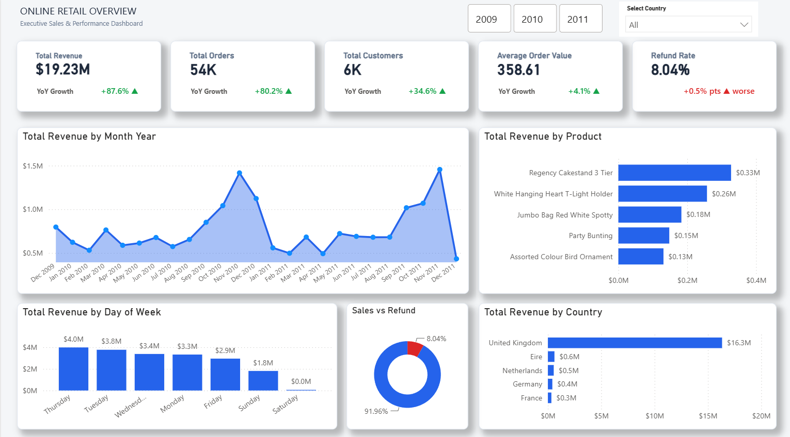
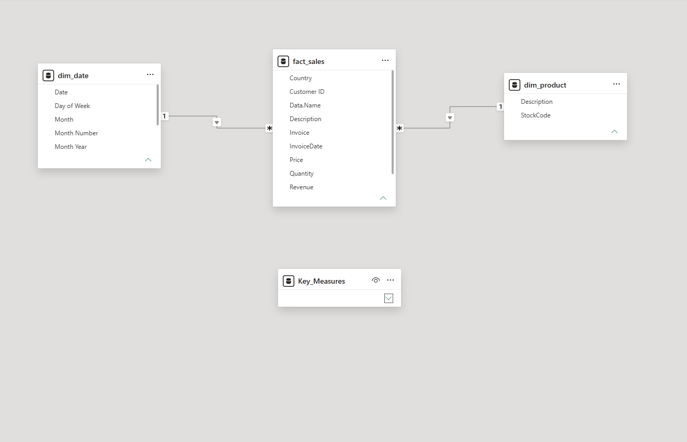

Online Retail Analytics — Executive Sales Dashboard (Power BI)

An end-to-end Power BI business intelligence project analyzing multi-year transactional sales data (UCI Online Retail II). This project demonstrates a production-grade data pipeline: from raw folder-based ingestion (handling mixed formats and dynamic sheet names) to star-schema modeling, advanced DAX time-intelligence metrics, and an executive-level performance dashboard.




## 📊 Project Objective

Provide retail executives and operations managers with an interactive, unified view of historical sales performance across three years (2009–2011) to answer key strategic questions:

- What is the true state of top-line revenue, transaction volume, and active customer growth?
- Which international markets and physical products drive the highest margins?
- How do sales trends fluctuate across calendar months and days of the week?
- What proportion of sales is lost to returns, and how does the refund rate change over time?
- Are key performance indicators (KPIs) growing year-over-year (YoY), and is that growth sustainable?

## 🗂️ Dataset

| Field | Value |
| --- | --- |
| Source | UCI Machine Learning Repository — Online Retail II Dataset |
| Period covered | 2009-12-01 → 2011-12-09 |
| Grain | Single invoice line item (1 row per product per transaction) |
| Total rows | ~1M+ (after folder consolidation) |
| Missing values | ~20.5% missing Customer ID (guest checkouts preserved as -1) |
| Duplicates | ~1.31% identical transactional duplicates (removed) |
| Formats | Mixed Excel (.xlsx) and CSV (.csv) |

## 🛠️ Tools & Skills Used

| Area | Tools & techniques |
| --- | --- |
| Data ingestion (ETL) | Power Query (M) folder ingest, nested functional transformations |
| Data cleaning | Trim/Clean/Proper casing, type casting, primary-key deduplication |
| Data modeling | Star schema, 1-to-many relationships, calculated DAX Date dimension |
| Calculations (DAX) | Time intelligence (SAMEPERIODLASTYEAR), KPI measures, conditional-format drivers |
| Visualization | Power BI Desktop, synchronized slicers, custom button tiles, card reference labels |
| Design principles | Executive grid, semantic green/red indicators, high-contrast margins |

## 🧱 Data Model — Star Schema

To optimize analytical query performance, the flat transactional data was modeled into a clean, high-performance Star Schema.

```
┌──────────────┐
│   dim_date   │
└──────┬───────┘
       │ 1
       │
       │ *
┌──────┴───────┐        ┌───────────────┐
│  fact_sales  │───*──1─│  dim_product  │
│  (measures)  │        └───────────────┘
└──────────────┘
```

### Fact table: `fact_sales`

| Column | Data type | Description |
| --- | --- | --- |
| Invoice | Text | Unique transaction identifier (values starting with `C` indicate cancellations) |
| StockCode | Text | Foreign key to `dim_product[StockCode]` |
| Quantity | Whole number | Units per line (negative values indicate returns/refunds) |
| InvoiceDate | Date | Foreign key to `dim_date[Date]` (timestamp stripped in Power Query) |
| Price | Decimal | Unit price |
| Customer ID | Whole number | Customer key (guest checkouts set to `-1`) |
| Country | Text | Transaction country |
| Revenue | Decimal | Calculated line value (`Quantity * Price`) |
| Source File | Text | Audit trail of the source filename |

### Dimension tables

| Table | Grain | Primary key | Description |
| --- | --- | --- | --- |
| `dim_product` | 1 row per unique product | StockCode | Cleaned product master resolving typos / historic naming |
| `dim_date` | 1 row per calendar day | Date | Date dimension for time-intelligence |

### Relationships

| From (1) | To (*) | Cardinality | Cross-filter |
| --- | --- | --- | --- |
| `dim_date[Date]` | `fact_sales[InvoiceDate]` | 1 : * | Single |
| `dim_product[StockCode]` | `fact_sales[StockCode]` | 1 : * | Single |

## 🔧 Power Query Transformation Steps

### 1) Automated “Magic Folder” ingestion

The report points to a local directory (`D:Practice Data_retail_II`). Power Query combines, cleans, and loads any file added to this folder.

| File type | Approach | Key step |
| --- | --- | --- |
| Excel (.xlsx) | Extract binary → expand only worksheet tables | `Excel.Workbook([Content], true)` then filter `Kind = "Sheet"` |
|  |  |  |

### 2) Fact and dimension separation (to avoid circular dependencies)

| Query | Type | Load enabled? | Purpose |
| --- | --- | --- | --- |
| `Raw_Retail` | Staging | No | Raw combined folder outputs |
| `fact_sales` | Reference | Yes | Cleaned transactions fact table |
| `dim_product` | Reference | Yes | Product catalog dimension |

### 3) Cleaning operations on `fact_sales`

- Trim/clean/proper-case text columns
- Filter out non-transactional rows
- Replace null Customer ID with `-1`
- Add calculated column: `Revenue = [Quantity] * [Price]`
- Remove exact duplicate transaction rows

### 4) Deduplicated `dim_product` methodology

To resolve a single StockCode having multiple names (typos/rebrands), a frequency-based method was used.

| Step | Operation | Output |
| --- | --- | --- |
| 1 | Keep `StockCode`, `Description` | Narrowed dataset |
| 2 | Remove empty/null descriptions | Valid descriptions only |
| 3 | Group by `StockCode`  • `Description` and count rows | Frequency per name |
| 4 | Sort count desc; remove duplicate StockCode rows | Most frequent description becomes master |
| 5 | Replace remaining nulls with `Unknown Product` | Finalized dimension |

## 💡 Key Insights

- Consolidated performance: >1M raw rows → **$19.23M** revenue across **54K** orders and **6K** registered customers.
- Refund rate: **8.04%** overall; YoY tracked in **percentage points** (+0.5 pts) for clarity.
- Geographic dominance: UK leads (**$16.3M** of $19.23M), then EIRE (~$0.6M) and Netherlands (~$0.5M).
- Saturday anomaly: **$0.0M** revenue on Saturdays (no operations).
- Operational fee impact: “Dotcom Postage” ranks #3 by revenue (~$0.18M), highlighting non-inventory revenue drivers.

## 🎯 Business Recommendations

- Optimize onboarding to minimize return rates (flag high-return products before shipping).
- Review Saturday operational closing (consider Saturday automation to capture weekend demand).
- Isolate postage fees from inventory reporting (separate filters for non-product stock codes).
- Develop loyalty programs outside the UK (target Netherlands and Germany to diversify revenue).

## 📁 Repository Structure

```
online-retail-powerbi/
├── README.md
├── pbix/
│   └── Online_Retail_Executive_Dashboard.pbix
├── assets/
│   ├── page1_overview.png
│   └── model_star_schema.png
└── data/
    └── README_data.txt
```

🚀 How to Reproduce
Clone this repository to your local machine:
Bash

git clone https://github.com/JahiduddinRasel/online-retail-powerbi.git

Create a local directory: D:\For Practice Data\online_retail_II.
Download raw datasets from UCI and place them into that directory.
Open Online_Retail_Executive_Dashboard.pbix inside the pbix/ folder using Power BI Desktop.
If data paths break: Go to Transform Data → select Raw_Retail → update the Source step folder path → click Close & Apply.


👤 Author
Jahiduddin Rasel
Data Analyst | Power BI · Power Query · DAX · Data Architecture

## 🏷️ Tags

`Power BI` `DAX` `Power Query` `Data Modeling` `Star Schema` `Folder Connector` `Retail Analytics` `Time Intelligence` `Executive Dashboard` `Business Intelligence`
